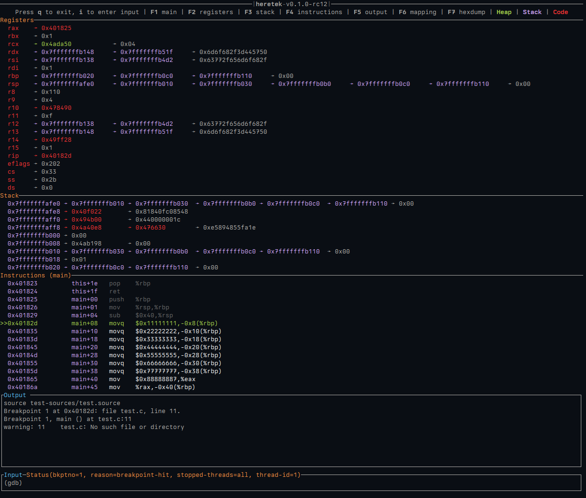

# heretek
[](https://github.com/wcampbell0x2a/heretek)
[](https://crates.io/crates/heretek)
[](https://github.com/wcampbell0x2a/heretek/actions?query=branch%3Amaster)

GDB TUI Dashboard inspired by `gef`, designed to seamlessly connect to remote targets even without a functioning `gdbserver`.

* **No python requirements**: Many vendors ship `gdb` without python support, we ship a single statically-linked musl binary.
* **Architecture agnostic**: `heretek` only uses information given by `gdb`, no extra code required!
* **No gdbserver requirements**: Many vendors ship invalid `gdbserver` binaries, this works on remote targets with just `gdb`, `nc`, `cat`, and `mkfifo`. No more wrestling with invalid or missing `gdbserver` binaries.

* See [features](./docs/features.md) for `heretek` demos.
* See [commands](./docs/commands.md) for internal `heretek` commands.



## Installation
Either build from published source in crates.io.
```
$ cargo install heretek --locked
```

Or download from [github releases](https://github.com/wcampbell0x2a/heretek/releases).

Arch Linux users can also install from the [official repositories](https://archlinux.org/packages/extra/x86_64/heretek/) via running `pacman -S heretek`

## Usage
```console
GDB TUI Dashboard for the understanding of vast knowledge

Usage: heretek [OPTIONS]

Options:
      --gdb-path <GDB_PATH>
          Override gdb executable path

  -r, --remote <REMOTE>
          Connect to nc session

          `mkfifo gdb_pipe; cat gdb_pipe | gdb --interpreter=mi | nc -l -p 12345 > gdb_pipe`

      --ptr-size <PTR_SIZE>
          Switch into 32-bit mode

          Heretek will do it's best to figure this out on it's own, but this will force the pointers to be evaluated as 32 bit

          [default: auto]
          [possible values: 32, 64, auto]

  -c, --cmds <CMDS>
          Execute GDB commands line-by-line from file

          lines starting with # are ignored

      --log-path <LOG_PATH>
          Path to write log

          Set env `RUST_LOG` to change log level

  -h, --help
          Print help (see a summary with '-h')

  -V, --version
          Print version
```

## Development
All patches/merge requests are welcome! See the development guide for more details.
[DEVELOPMENT.md](DEVELOPMENT.md).

> "To every problem, a solution lies in the application of tech-lore" - Ferrarch Asklepian, Warhammer 40,000: Mechanicus
