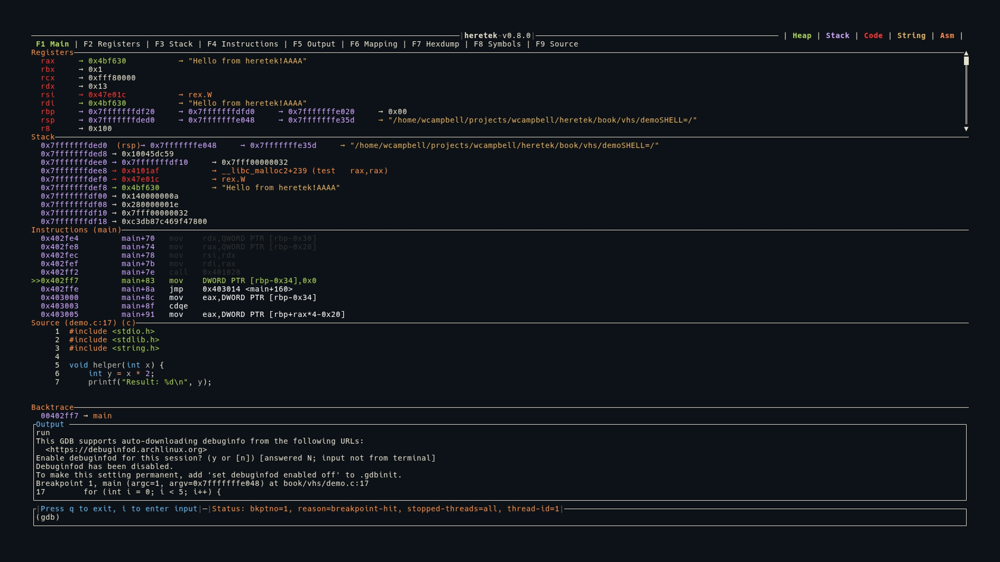

# Features

heretek provides a full-featured TUI dashboard for GDB. The interface is organized into tabs, each accessible via function keys:

| Key | Tab | Description |
|-----|-----|-------------|
| F1 | [Main View](./main-view.md) | Combined view: Registers, Stack, Instructions, Source |
| F2 | [Registers](./registers.md) | Full-screen register display with dereference chains |
| F3 | [Stack](./stack.md) | Full-screen stack view |
| F4 | [Instructions](./instructions.md) | Full-screen disassembly |
| F5 | [Output](./output.md) | Scrollable GDB output log |
| F6 | [Mapping](./mapping.md) | Memory mapping table with hexdump integration |
| F7 | [Hexdump](./hexdump.md) | Color-coded memory hexdump with register annotations |
| F8 | [Symbols](./symbols.md) | Symbol browser with fuzzy search and disassembly |
| F9 | [Source](./source.md) | Syntax-highlighted source code view |

Press `Tab` to cycle through views in order:



## Color Coding

All values across every view are color coded by memory region:

- **<span style="color: #aad94c">Green</span>** — Heap memory
- **<span style="color: #d2a6ff">Purple</span>** — Stack memory
- **<span style="color: #ff3333">Red</span>** — Code/text segment
- **<span style="color: #e6b450">Yellow</span>** — ASCII strings
- **<span style="color: #ff8f40">Orange</span>** — Assembly instructions

See [Color Coding](../colors.md) for full details.

## Pointer Dereference Chains

A key feature across Registers and Stack views is automatic pointer dereference. heretek follows pointer chains and displays them inline:

```
rax  0x7fffffffe000 → 0x00400580 → main+0 (push rbp)
rdi  0x7fffffffe1a8 → 0x7fffffffe3b0 → "/home/user/a.out"
```

- Numeric values are color-coded by which memory region they point to
- Function pointers show the symbol name and instruction
- C-strings are detected and displayed in yellow
- Circular pointer chains are detected and shown as `→ [loop detected]`

## Automatic Data Collection

Every time the program stops (breakpoint, step, signal), heretek automatically collects:

- Register names and values
- Changed registers (highlighted in red)
- Stack contents (14 entries from `$sp`)
- Disassembly around `$pc`
- Memory mappings
- Backtrace frames
- Source file and line number
- Pointer dereference chains for all registers
