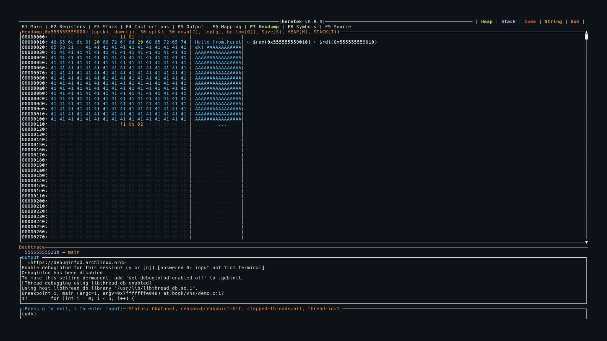

# Hexdump (F7)

The Hexdump view provides a color-coded display of raw memory contents with register annotations.



## Display

Each row shows 16 bytes:

```
OFFSET: HH HH HH HH HH HH HH HH  HH HH HH HH HH HH HH HH | ASCII.text.. | ← $rsp(0x7fffe000)
```

- **Offset**: Address of the first byte in the row
- **Hex bytes**: Each byte color-coded (see below)
- **ASCII column**: Printable characters shown as-is, non-printable shown as `.`
- **Register annotations**: If a register's value matches an address in the row, it's shown on the right as `← $regname(0xVALUE)`

## Byte Color Coding

| Color | Meaning |
|-------|---------|
| Dark gray | Null bytes (`0x00`) |
| Blue | Printable ASCII characters |
| Green | ASCII whitespace (space, tab, newline) |
| Orange | ASCII control characters |
| Yellow | Non-ASCII bytes (`>= 0x80`) |

## Loading Data

There are several ways to load memory into the hexdump:

| Method | Description |
|--------|-------------|
| `hexdump <addr> <len>` | Dump arbitrary address and length |
| `H` key (in Hexdump view) | Load the first heap mapping |
| `T` key (in Hexdump view) | Load the first stack mapping |
| `H` key (in Mapping view) | Load the selected mapping |

Address and length can be hex (`0x...`) or decimal. You can also use [heretek variables](../commands.md):

```
hexdump $HERETEK_MAPPING_START_[heap] $HERETEK_MAPPING_LEN_[heap]
```

## Saving to File

Press `S` to open the Save popup. Type a file path and press `Enter` to save the raw bytes to disk. `~/` expansion is supported.

## Keybindings

| Key | Action |
|-----|--------|
| `g` | Jump to top |
| `G` | Jump to bottom |
| `j` | Scroll down 1 row (16 bytes) |
| `k` | Scroll up 1 row |
| `J` | Scroll down 50 rows |
| `K` | Scroll up 50 rows |
| `H` | Load heap into hexdump |
| `T` | Load stack into hexdump |
| `S` | Save hexdump to file |
