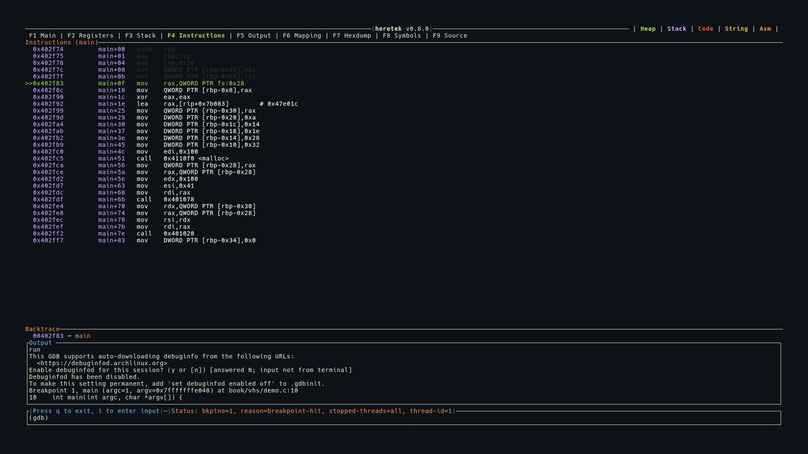

# Instructions (F4)

The Instructions view shows disassembled code around the current program counter (`$pc`).



## Display

Instructions are shown as a table with three columns:

```
  Address          Function+Offset    Instruction
  0x00401234       main+0             push   rbp
  0x00401235       main+1             mov    rbp, rsp
>>0x00401238       main+4             sub    rsp, 0x10     ← current $pc
  0x0040123c       main+8             mov    eax, 0x0
```

- The **current instruction** (`$pc`) is highlighted in green with a `>>` marker
- Instructions before `$pc` are shown in white
- Addresses and function+offset are shown in purple
- The panel title shows the current function name: `Instructions (main)`

## Disassembly Range

heretek disassembles a window around `$pc`:
- 5 instructions before `$pc`
- 10 instructions after `$pc`

The view auto-scrolls to keep `$pc` visible.

## Syntax

Intel syntax is used by default — heretek sends `set disassembly-flavor intel` to GDB when a program is run or attached.
