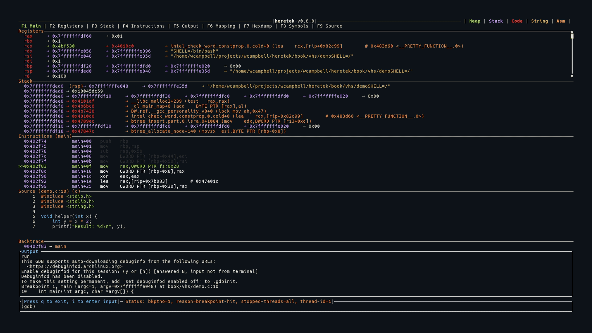

# Main View (F1)

The main view is the default display, combining Registers, Stack, Instructions, and Source into a single screen.

## Layout

All panels are stacked vertically. Registers takes as much space as needed (minimum 10 lines), while Stack and Instructions have fixed heights (11 lines each). Source fills remaining space when available.

When no program is loaded, the Registers panel displays the heretek ASCII art logo.

When source code is not available (e.g., stripped binary), the Source panel is hidden.

The Backtrace panel appears between the content area and the Output strip whenever backtrace frames are available.

## Keybindings

| Key | Action |
|-----|--------|
| `j` | Scroll registers down |
| `k` | Scroll registers up |
| `J` | Scroll registers down 50 lines |
| `K` | Scroll registers up 50 lines |

See [Keybindings](../keybindings.md) for the full reference.
