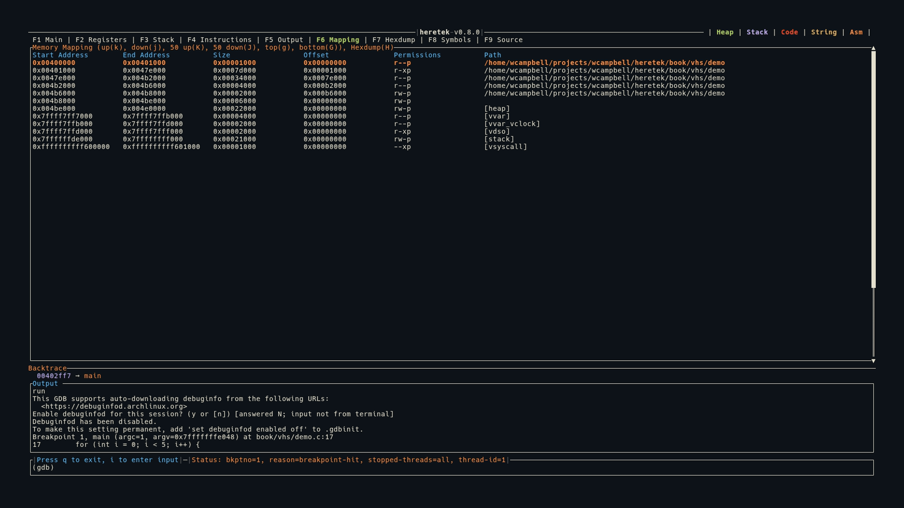

# Memory Mapping (F6)

The Mapping view shows the current process memory mappings in a navigable table.



## Display

```
Start Address        End Address          Size                 Offset               Permissions          Path
0x00400000           0x00401000           0x00001000           0x00000000           r--p                 a.out
0x00401000           0x00479000           0x00078000           0x00001000           r-xp                 a.out
0x00602000           0x00603000           0x00001000           0x00002000           rw-p                 a.out
0x01234000           0x01255000           0x00021000           0x00000000           rw-p                 [heap]
0x7ffff7dce000       0x7ffff7df0000       0x00022000           0x00000000           r--p                 libc.so.6
```

- The header row is shown in blue
- The selected row is highlighted in orange + bold
- A vertical scrollbar appears on the right

## Region Classification

Mappings are classified for color coding across the application:
- `[stack]` → Stack (purple)
- `[heap]` → Heap (green)
- Executable permission or matching binary path → Code/text (red)

## Hexdump Integration

Press `H` on any selected mapping to load its contents into the Hexdump view. This is a quick way to inspect any memory region.

## GDB Compatibility

heretek supports both old and new GDB memory mapping formats:
- **GDB ≤ 7.12**: `Start Addr  End Addr  Size  Offset  objfile` (no permissions column)
- **GDB ≥ 15.1**: `Start Addr  End Addr  Size  Offset  Perms  objfile`

## Keybindings

| Key | Action |
|-----|--------|
| `g` | Jump to first entry |
| `G` | Jump to last entry |
| `j` | Move selection down 1 |
| `k` | Move selection up 1 |
| `J` | Move selection down 50 |
| `K` | Move selection up 50 |
| `H` | Open selected mapping in Hexdump view |
