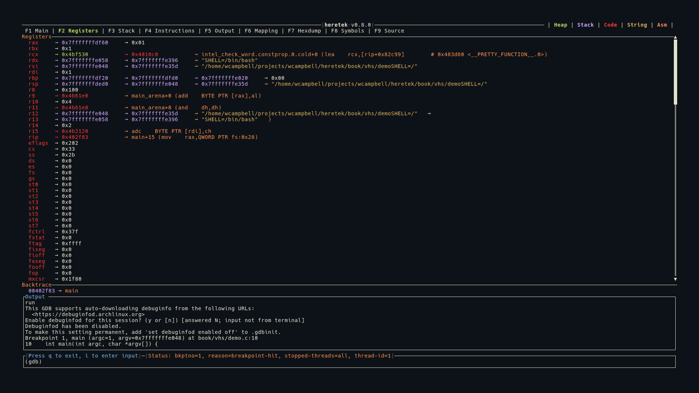

# Registers (F2)

The Registers view shows a full-screen display of all CPU registers with their current values and dereference chains.



## Display

Each register is shown as:

```
register_name  0xVALUE → dereferenced_value → ...
```

- Register names are left-padded for alignment
- Values are displayed in hexadecimal
- Values are color-coded by memory region (heap/stack/code)
- **Changed registers** are highlighted in red — registers whose values changed since the last stop

## Dereference Chains

Each register value is automatically dereferenced to follow pointer chains:

```
rax  0x7fffffffe000 → 0x00400580 → main+0 (push rbp)
rdi  0x7fffffffe1a8 → 0x7fffffffe3b0 → "/home/user/a.out"
rsp  0x7fffffffdfe0 → 0x0000000000000001
```

The dereference engine:
- Follows pointers through memory, reading `ptr_size` bytes at each step
- Detects **ASCII strings** and displays them in yellow
- Detects **code pointers** and shows the symbol + instruction in orange
- Detects **pointer loops** and stops with `→ [loop detected]` in gray

## 32-bit vs 64-bit

- In 64-bit mode: values displayed as 19-character hex (e.g., `0x00007fffffffe000`)
- In 32-bit mode: values displayed as 11-character hex (e.g., `0xffffdfe0`)
- Pointer size affects dereference reads (4 vs 8 bytes per step)

## Keybindings

| Key | Action |
|-----|--------|
| `j` | Scroll down 1 line |
| `k` | Scroll up 1 line |
| `J` | Scroll down 50 lines |
| `K` | Scroll up 50 lines |
