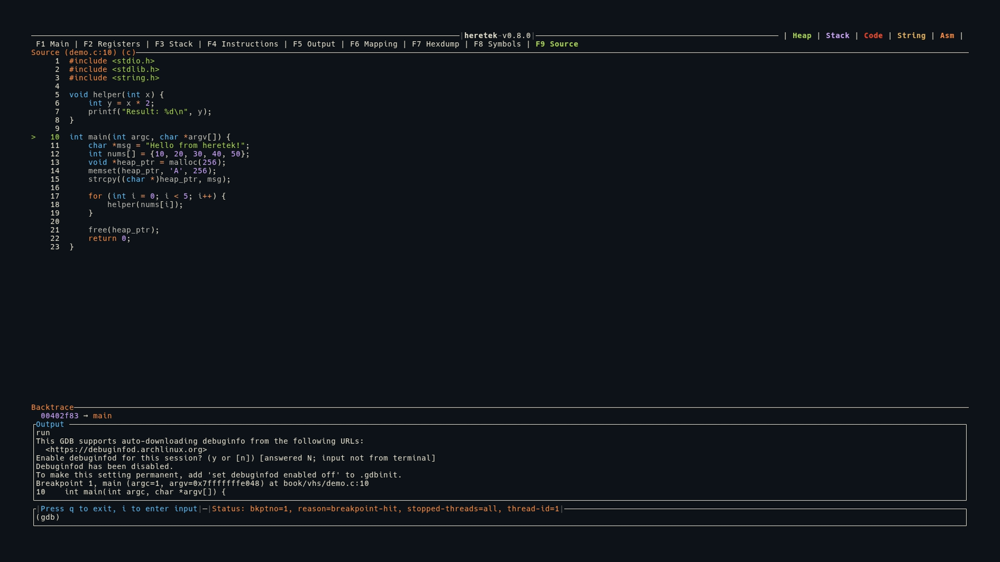

# Source (F9)

The Source view shows syntax-highlighted source code for the current execution point, when source files are available.



## Display

```
  Source (main.c:42) (c)
     40│  int x = 10;
     41│  int y = 20;
  >  42│  int z = x + y;
     43│  printf("%d\n", z);
     44│  return 0;
```

- The panel title shows the filename, line number, and detected language: `Source (main.c:42) (c)`
- The current line is marked with `>` in green
- Line numbers are displayed in a left column

## Syntax Highlighting

Source code is syntax-highlighted using treesitter (via the `arborium` crate) with the **Ayu Dark** theme.

Supported languages:
- **C**
- **C++**
- **Rust**

The language is auto-detected from GDB's `show language` output.

## Source Detection

Source file and line information comes from GDB stop events:
1. The `fullname` field (absolute path) from `*stopped` MI records
2. Falls back to the `file` field if `fullname` is not available
3. The actual file is read from disk — the source must be present on the local filesystem

## In Main View

When source is available, the Source panel appears as the bottom section of the Main (F1) view, below Instructions. If no source is available, the Source panel is hidden.

## Keybindings

| Key | Action |
|-----|--------|
| `g` | Jump to top of file |
| `G` | Jump to bottom of file |
| `j` | Scroll down 1 line |
| `k` | Scroll up 1 line |
| `J` | Scroll down 50 lines |
| `K` | Scroll up 50 lines |
