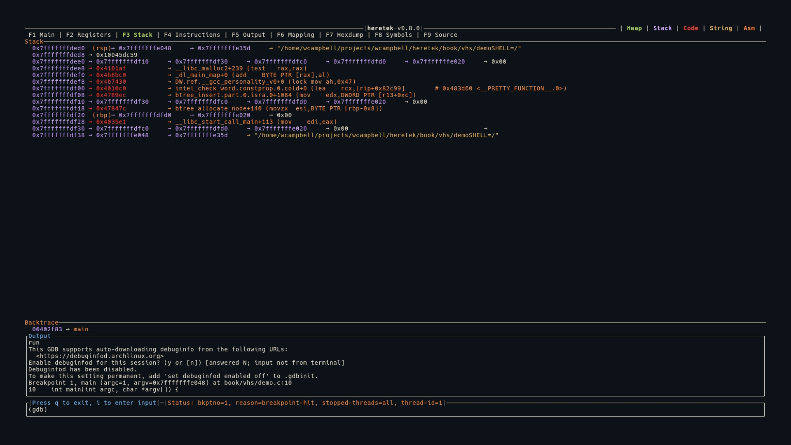

# Stack (F3)

The Stack view shows the contents of memory starting from the current stack pointer (`$sp`).



## Display

14 stack entries are displayed, each at `ptr_size` byte intervals from `$sp`:

```
0x7fffffffdfe0 (rsp)     0x0000000000000001
0x7fffffffdfe8           0x00007fffffffe1a8 → "/home/user/a.out"
0x7fffffffdff0 (rbp)     0x0000000000000000
```

- **Addresses** are shown in purple on the left
- **Register annotations** appear in orange when a register points to that stack address (e.g., `(rsp)`, `(rbp)`)
- **Values** are color-coded by memory region
- Each entry includes a full dereference chain, identical to the Registers view

## Register Cross-Reference

The stack view cross-references all current register values against displayed stack addresses. If any register's value matches a stack entry's address, the register name is shown next to that entry. This makes it easy to see where `rsp`, `rbp`, and other registers point on the stack.
