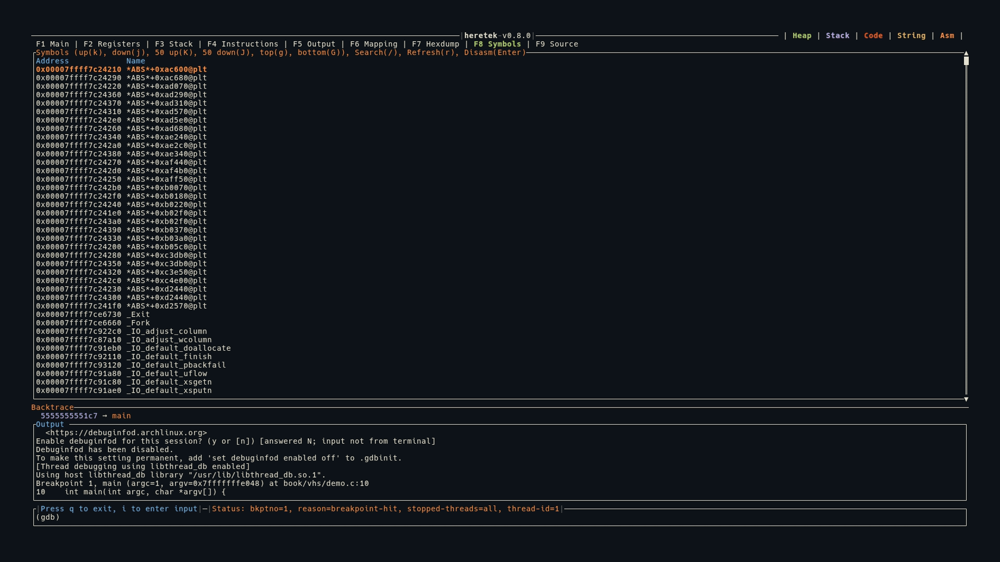

# Symbols (F8)

The Symbols view provides a browsable list of all function symbols in the loaded binary, with fuzzy search and inline disassembly.



## Symbol List

When you first switch to the Symbols tab, heretek runs `info functions` to populate the symbol list. Each symbol is shown with its address and name:

```
Address            Name
0x0000000000401000 _start
0x0000000000401030 main
0x0000000000401080 helper_function
```

- Header row in blue
- Selected row highlighted in orange + bold
- Vertical scrollbar on the right

## Fuzzy Search

Press `/` to activate the search bar at the bottom of the panel.

- Search is **fuzzy**: all characters of your search term must appear in order in the symbol name, but don't need to be consecutive
- Filter is applied **live** as you type
- Press `Enter` to finish searching (filter stays active)
- Press `Esc` to cancel the search
- The title shows the active filter: `Symbols - Filtered: "main"`
- Press `/` again to start a new search (clears the old filter)

## Inline Disassembly

Press `Enter` on a selected symbol to disassemble it. The view splits into two panels:

```
┌──────────────────┬──────────────────────────────────┐
│  Symbol List     │  Disassembly: main               │
│  (30% width)     │  (70% width)                     │
│                  │                                  │
│ > main           │  0x401030  push   rbp            │
│   helper_func    │  0x401031  mov    rbp, rsp       │
│   _start         │  0x401034  sub    rsp, 0x10      │
│                  │  0x401038  mov    eax, 0x0        │
└──────────────────┴──────────────────────────────────┘
```

- The disassembly panel shows the function's instructions (up to 500 bytes)
- Scroll keys (`j/k/J/K/g/G`) control the disassembly panel when it's open
- Press `Esc` to close the disassembly and return to the symbol list

## Refresh

Press `r` or `R` to re-run `info functions` and refresh the symbol list. Useful after loading new symbols or shared libraries.

## Keybindings

| Key | Action |
|-----|--------|
| `g` | Jump to top |
| `G` | Jump to bottom |
| `j` | Move selection / scroll down 1 |
| `k` | Move selection / scroll up 1 |
| `J` | Move down / scroll 50 |
| `K` | Move up / scroll 50 |
| `/` | Activate fuzzy search |
| `Enter` | Disassemble selected symbol |
| `Esc` | Close disassembly / cancel search |
| `r` / `R` | Refresh symbol list |
