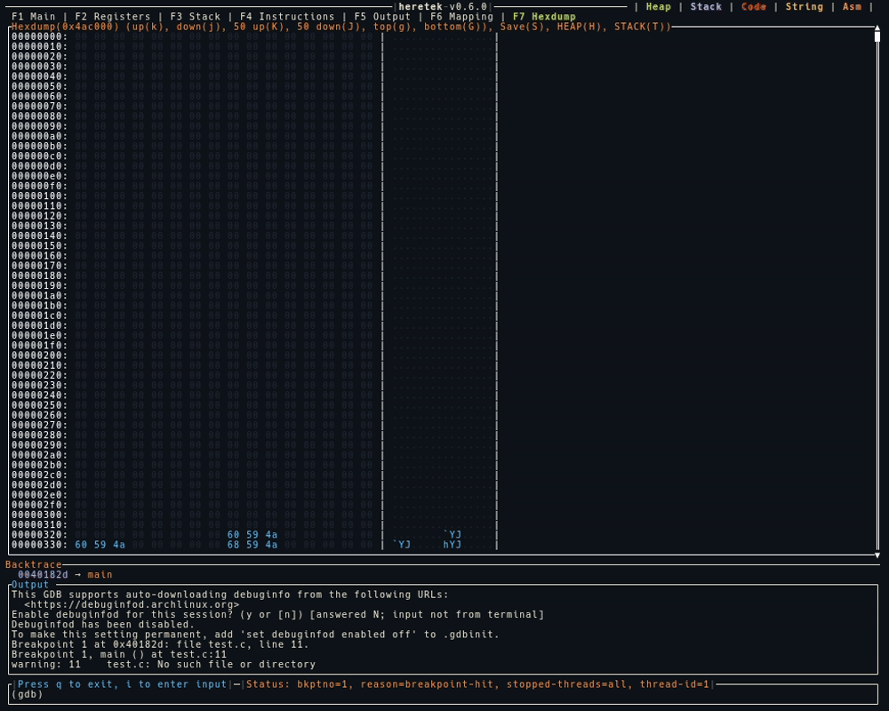

# Main
The main display shows the Registers, Stack, Instructions, and Output that is current to the the gdb session.
Those sections can be expanded by selecting the function keys shown at the top.

The following example shows an operator stepping through a function using `si`.

# Hexdump
The hexdump screen is an easy way to see the color coded contents of the Heap, Stack, or another mapping or offset.
Each register is shown if the value matches the address being dumped.

The following example shows an operator dumping the contents of the Heap and searching.

