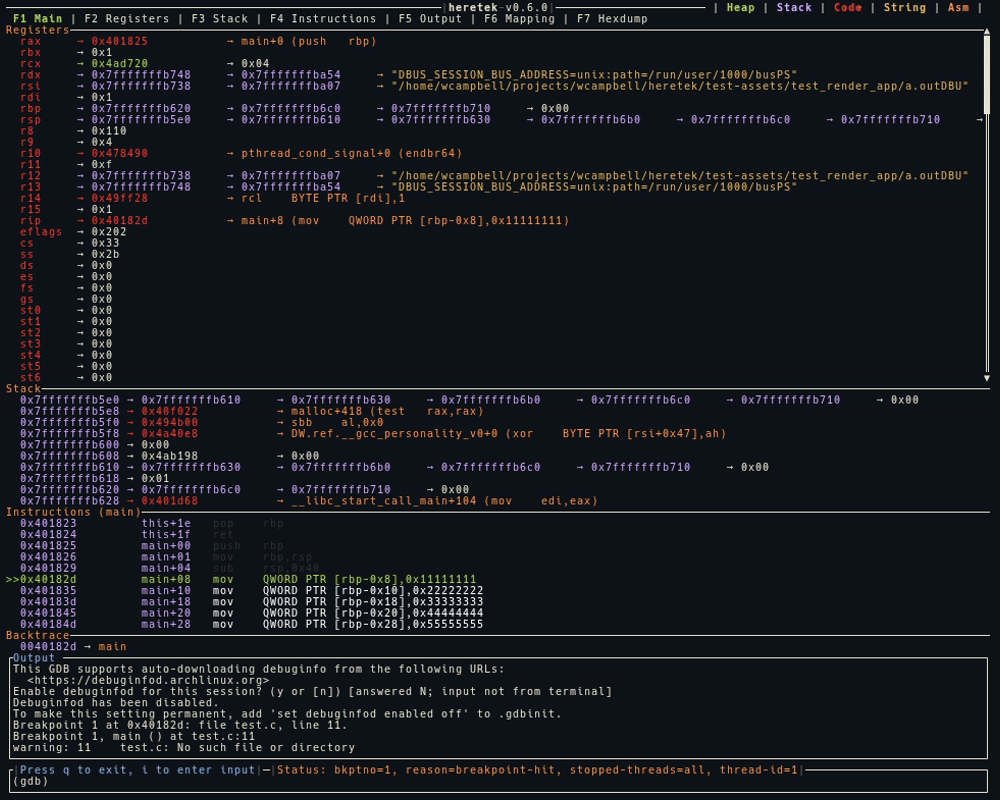

# Main
The main display shows the Registers, Stack, Instructions, and Output that is current to the gdb session.
Those sections can be expanded by selecting the function keys shown at the top.
All values are color coded contents of Heap, Stack, Code, String, and ASM.

The following example shows an operator stepping through a function using `si`.

# Register
Shows the state of the current CPU registers.
1. Attempts to de-ref pointers to show what value is pointed at.
2. For function pointers, show the symbols if available, and instruction.
3. Attempts to read c-strings.

# Stack
Shows the state of the current stack pointer.
1. Attempts to de-ref pointers to show what value is pointed at.
2. For function pointers, show the symbols if available, and instruction.
3. Attempts to read c-strings.

# Instruction
Shows the current function and assembly at $pc.

# Breakpoint
Shows the current output of `bt`.

# Mapping
Shows the current memory mapping names, size, position, and permission.

# Output
Show commands that we wrote, as well as the raw gdb stdout output.

# Hexdump
The hexdump screen is an easy way to see the color coded contents of the Heap, Stack, or another mapping or offset.
Each register is shown if the value matches the address being dumped.

The following example shows an operator dumping the contents of the Heap and searching.

